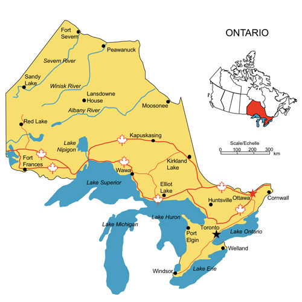
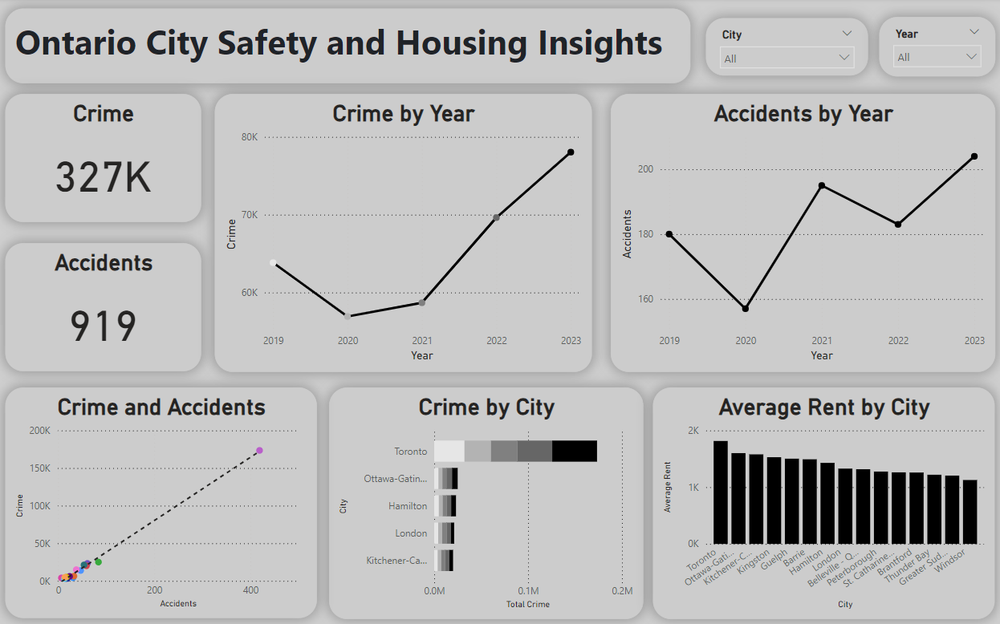

<h1 align="center">Ontario City Safety and Housing Insights</h1>

  

## Table of Contents
1. [Project Overview](#project-overview)
2. [Project Scope](#project-scope)
3. [Data Sources](#data-sources)
4. [Folder Structure](#folder-structure)
5. [Data Cleaning and EDA](#data-cleaning-and-eda)
6. [Visualizations](#visualizations)
7. [Conclusion](#conclusion)
8. [Author](#author)
9. [Dependencies](#dependencies)

## Project Overview
This project aims to analyze safety and housing trends across cities in Ontario by exploring data related to crime rates, accidents, and average rent prices. Through visualizations, the project uncovers insights that can support stakeholders in making informed decisions on urban safety and housing affordability.

## Project Scope
The primary objectives of this project are:
- To analyze trends in crime and accident rates across various cities in Ontario over time.
- To explore the relationship between crime rates, accident trends, and rental prices in different cities.
- To identify key cities with significant trends in safety and housing, which could help guide urban planning and policy-making.

## Data Sources
- **Crime Data**: Ontario Police Services open data
- **Accident Data**: Ontario Traffic Management and City Services
- **Rental Data**: Canada Mortgage and Housing Corporation (CMHC)

## Folder Structure
This project follows the Cookiecutter Data Science structure and includes the following folders:

- **`data/`**: Contains raw and processed data files.
  - `raw/` - Original datasets
  - `processed/` - Cleaned datasets for analysis

- **`src/`**: Contains SQL queries and other scripts used for data cleaning and exploratory data analysis (EDA).
  - `cleaning/` - SQL queries for data cleaning
  - `eda/` - SQL queries for exploratory data analysis

- **`reports/`**: Contains project reports, visualizations, and assets.
  - `figures/` - PNG images of the Power BI dashboard
  - `videos/` - Videos demonstrating the Power BI dashboard
  - `powerbi/` - Power BI workbook files and dashboard

- **`README.md`**: This file.

## Data Cleaning and EDA
Data cleaning and exploratory data analysis were performed using SQL to prepare the data for visualization. Each dataset was processed to ensure consistency, accuracy, and relevancy before being imported into Power BI for visualization.

## Visualizations
Interactive dashboards were created using Tableau to visualize key insights. The following dashboard elements are included:

1. **Crime and Accident Summary**: Shows total crime and accident counts across Ontario.
2. **Crime by Year**: Displays annual crime trends, highlighting year-over-year changes.
3. **Accidents by Year**: Shows trends in accidents over the years.
4. **Crime and Accidents Correlation**: A scatter plot indicating any correlation between crime rates and accident rates.
5. **Crime by City**: Highlights total crime across Ontario cities.
6. **Average Rent by City**: A bar chart depicting average rental prices in various Ontario cities.

**Dashboard Image**:  

**Dashboard Demo**:

https://github.com/user-attachments/assets/31daf4ee-6f83-4a60-a01f-3851901c99f3

## Conclusion
This project provides valuable insights into safety and housing trends in Ontario cities. By visualizing crime, accident, and rental data, the dashboards offer an interactive way to explore trends and identify potential areas for improvement. The findings can assist urban planners and policymakers in understanding the interconnections between public safety and housing affordability across the province.

## Author
Nikhil Sreenivasan

## Dependencies
- **MySQL**: For data cleaning and EDA.
- **Power BI**: For data visualization.
